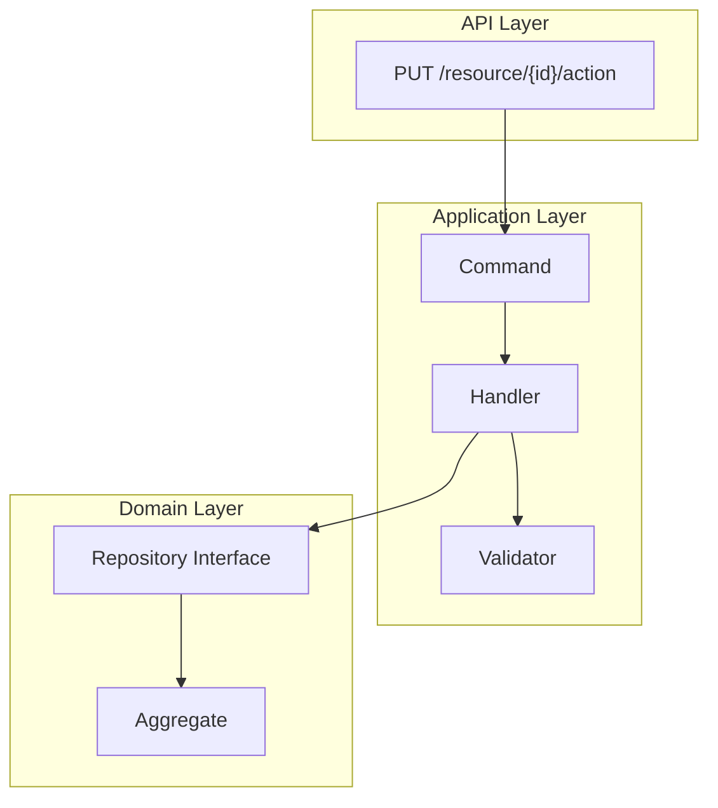
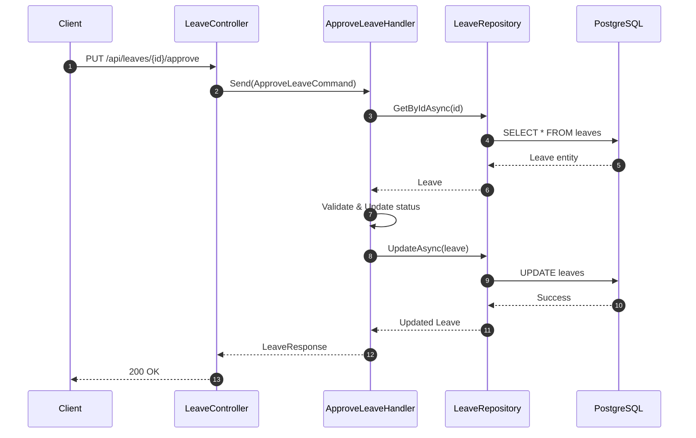
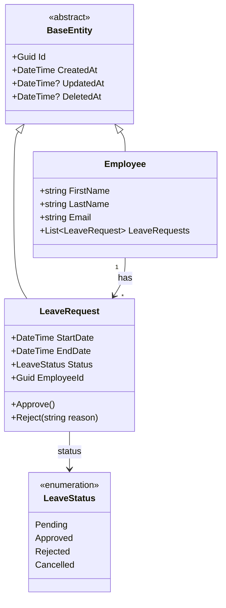
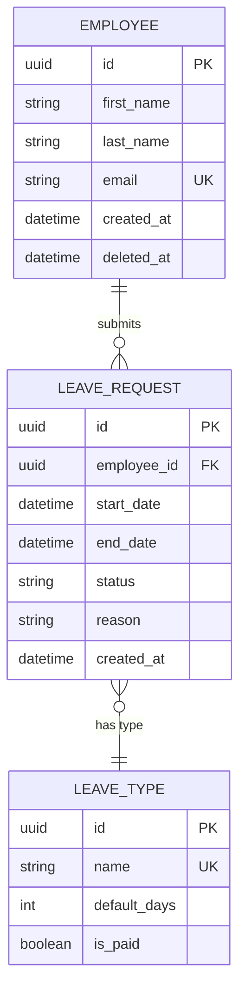
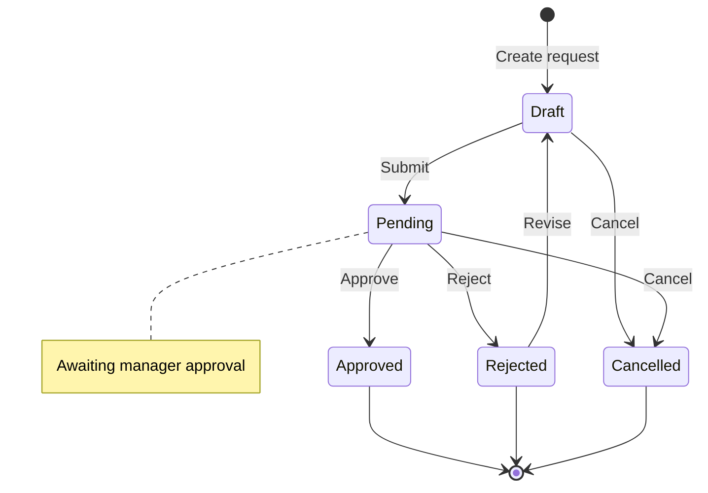
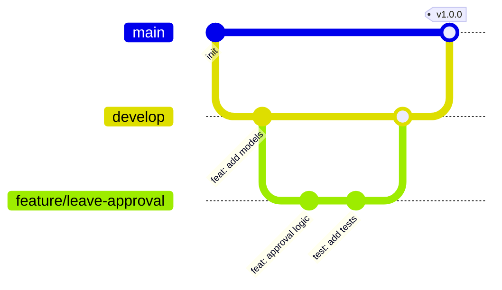
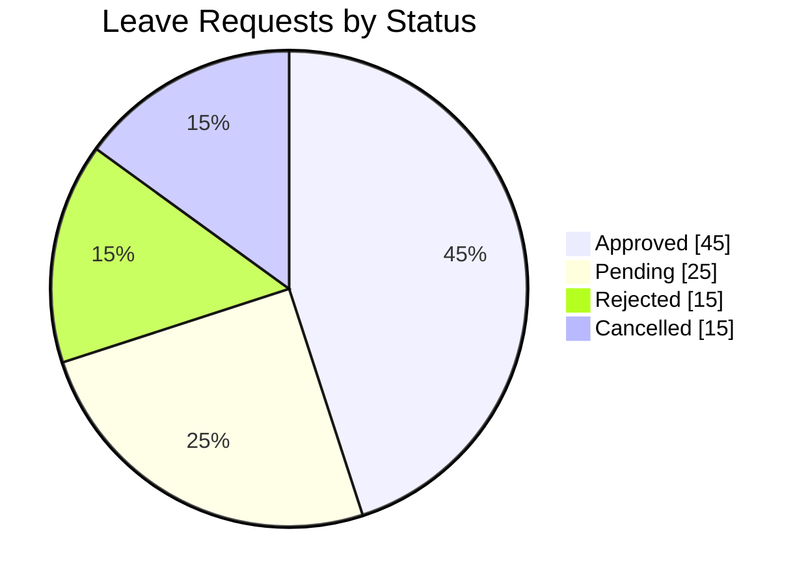
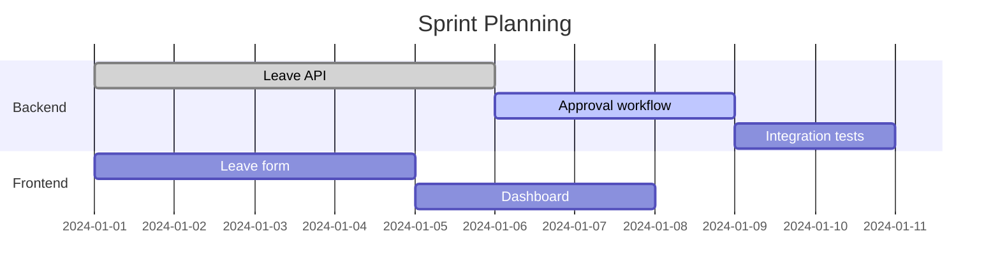

# Copilot Instructions — Mermaid Diagrams

## 🎯 Objective

Generate **valid, readable, and maintainable Mermaid diagrams** following consistent conventions suitable for technical documentation and architecture diagrams.

---

## ✅ General Rules

1. **Always specify the diagram type**
   Choose the appropriate diagram type based on the context:
   | Type | Use Case |
   |------|----------|
   | `flowchart TD` | Process flows, architecture layers, decision trees |
   | `sequenceDiagram` | API calls, service interactions, request/response flows |
   | `classDiagram` | Domain models, class relationships, inheritance |
   | `erDiagram` | Database schemas, entity relationships |
   | `stateDiagram-v2` | State machines, workflow states, lifecycle |
   | `gitGraph` | Branching strategies, release flows |
   | `pie` | Distribution, percentages, statistics |
   | `gantt` | Project timelines, task scheduling |

2. **Quote labels containing special characters**
   Wrap text in double quotes when it contains: `{ }`, `/`, `:`, `#`, `()`, or spaces.

   **Good:**
   ```mermaid
   A1["PUT /api/leaves/{id}/approve"]
   ```

3. **Prefer meaningful identifiers + labels**
   * Technical ID: `A1`, `B2`, `C3`, etc.
   * Human label: clear, concise, and descriptive.

---

## 📊 Diagram Type Guidelines

### Flowchart (Architecture & Processes)

Use for visualizing application layers, data flows, and decision logic.



**Arrow conventions:**
| Arrow  | Meaning                                  |
| ------ | ---------------------------------------- |
| `-->`  | Normal control/data flow                 |
| `-.->` | Asynchronous / event-driven flow         |
| `==>`  | Strong dependency or commitment          |
| `-.-`  | Relationship / reference (not execution) |

---

### Sequence Diagram (Interactions)

Use for API calls, service-to-service communication, and request/response flows.



**Conventions:**
- Use `autonumber` for step tracking
- `->>` for synchronous calls, `-->>` for responses
- `--)` for async messages (fire-and-forget)
- Use `participant` aliases for readability
- Group related steps with `rect` or `alt`/`else`

---

### Class Diagram (Domain Models)

Use for entity relationships, inheritance, and domain modeling.



**Conventions:**
- Use `<<abstract>>`, `<<interface>>`, `<<enumeration>>` stereotypes
- Show visibility: `+` public, `-` private, `#` protected
- Use generics with `~Type~` syntax
- Relationship arrows: `<|--` inheritance, `-->` association, `..>` dependency

---

### ER Diagram (Database Schema)

Use for database design and entity relationships.



**Conventions:**
- Mark keys: `PK` (primary), `FK` (foreign), `UK` (unique)
- Cardinality: `||` one, `o{` zero-or-many, `|{` one-or-many
- Use snake_case for column names

---

### State Diagram (Workflows)

Use for state machines and lifecycle management.



**Conventions:**
- Use `[*]` for start/end states
- Add transitions with labels: `State1 --> State2: Action`
- Use `note` for additional context
- Group states with `state "name" as alias { }`

---

### Git Graph (Branching Strategy)

Use for visualizing Git workflows and release strategies.



---

### Pie Chart (Statistics)

Use for showing distributions and proportions.



---

### Gantt Chart (Planning)

Use for project timelines and task scheduling.



---

## 🧱 Naming Conventions

| Layer | Pattern | Examples |
|-------|---------|----------|
| API | `HTTP_METHOD /path` | `POST /api/leaves` |
| Application | `XxxCommand`, `XxxHandler`, `XxxValidator` | `ApproveLeaveCommand` |
| Domain | `Entity`, `ValueObject`, `Enum` | `Employee`, `LeaveStatus` |
| Database | `snake_case` tables/columns | `leave_request`, `employee_id` |

---

## ⚠️ Common Pitfalls to Avoid

* ❌ Using `{}` without quotes in labels
* ❌ Overcrowded diagrams (max ~12-15 nodes per view)
* ❌ Mixing diagram types inappropriately
* ❌ Missing `autonumber` in complex sequence diagrams
* ❌ Vague labels like `Service` or `Manager` without context
* ❌ Forgetting relationship cardinality in ER diagrams

---

## 🧪 Validation Checklist

Before returning a Mermaid diagram:

* [ ] Parses correctly in [Mermaid Live Editor](https://mermaid.live)
* [ ] All special characters are quoted
* [ ] Diagram type matches the use case
* [ ] Naming is consistent with conventions
* [ ] Not overcrowded (split if needed)
* [ ] Arrows/relationships make logical sense

---

## ✨ Optional Enhancements

If requested:
* Add comments using `%%`
* Use `classDef` for custom styling
* Add `click` handlers for interactive diagrams
* Use `rect` backgrounds in sequence diagrams for grouping
